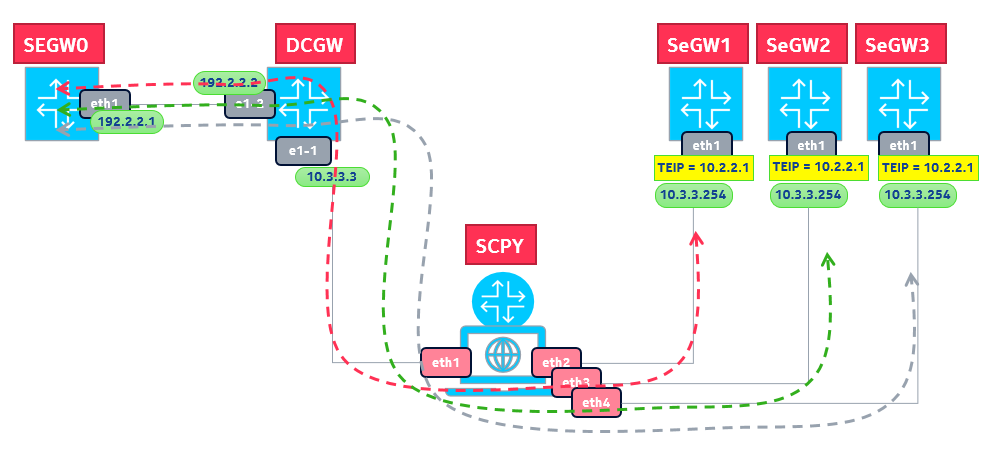

# scapysec

## intro

scapysec is L2 (transparent) IPsec tunnel load balancer, it has to be used as **modeling tool** by which you 
can study and test effects of load balancing across a set of tunnel termination devices, 
hereinafter called security gateways (aka _segw_).

it is based on [scapy](https://scapy.readthedocs.io/en/latest/index.html) and runs on [containerlab](https://github.com/srl-labs/containerlab) as usual

## how it works

the SCPY container (based on a customized Alpine image you can get from [dockerhub](https://hub.docker.com/repository/docker/federic0/fedepine/general)) keeps track of source IP addresses
of tunnels generated by SEGW0. An hash table provides for associating tunnels-IP-destMAC addresses to spray tunnels
across a set of segw. in this case, there are 3 serving segw implemented on Nokia SR-OS virtual sim's. 



there's also an instance of Nokia SRL, used in this case as Datacenter Gateway. 
the SCPY node at startup configures proxy-arp in all its interfaces. 
the SCPY node performs destination MAC-Address swap for each packet belonging to a tunnel.
Eventually, you will end up with SEGW1-2-3 loaded with tunnels in a round-robin way as:  

```
A:admin@SEGW1# show ipsec gateway name "IPSECGW1" tunnel 

===============================================================================
IPsec Remote User Tunnels
===============================================================================
Remote Endpoint Addr                      GW Name            
 GW Lcl Addr                              SvcId             TnlType
  Private Addr                            Secure SvcId      BiDirSA
   Idi-Type      Value*                                     
-------------------------------------------------------------------------------
10.100.1.2:500                            IPSECGW1          
 10.2.2.1                                 100               psk
                                          200               true
   ipv4Addr       10.100.1.2                                                  
10.100.2.2:500                            IPSECGW1          
 10.2.2.1                                 100               psk
                                          200               true
   ipv4Addr       10.100.2.2                                                  
10.100.4.2:500                            IPSECGW1          
 10.2.2.1                                 100               psk
                                          200               true
   ipv4Addr       10.100.4.2                                                  
10.100.5.2:500                            IPSECGW1          
 10.2.2.1                                 100               psk
                                          200               true
   ipv4Addr       10.100.5.2                                                  
-------------------------------------------------------------------------------
IPsec Gateway Tunnels: 4
===============================================================================

A:admin@SEGW2# show ipsec gateway name "IPSECGW1" tunnel 

===============================================================================
IPsec Remote User Tunnels
===============================================================================
Remote Endpoint Addr                      GW Name            
 GW Lcl Addr                              SvcId             TnlType
  Private Addr                            Secure SvcId      BiDirSA
   Idi-Type      Value*                                     
-------------------------------------------------------------------------------
10.100.0.2:500                            IPSECGW1          
 10.2.2.1                                 100               psk
                                          200               true
   ipv4Addr       10.100.0.2                                                  
10.100.2.2:500                            IPSECGW1          
 10.2.2.1                                 100               psk
                                          200               true
   ipv4Addr       10.100.2.2                                                  
10.100.3.2:500                            IPSECGW1          
 10.2.2.1                                 100               psk
                                          200               true
   ipv4Addr       10.100.3.2                                                  
10.100.5.2:500                            IPSECGW1          
 10.2.2.1                                 100               psk
                                          200               true
   ipv4Addr       10.100.5.2                                                  
-------------------------------------------------------------------------------
IPsec Gateway Tunnels: 4
===============================================================================

A:admin@SEGW3# show ipsec gateway name "IPSECGW1" tunnel 

===============================================================================
IPsec Remote User Tunnels
===============================================================================
Remote Endpoint Addr                      GW Name            
 GW Lcl Addr                              SvcId             TnlType
  Private Addr                            Secure SvcId      BiDirSA
   Idi-Type      Value*                                     
-------------------------------------------------------------------------------
10.100.0.2:500                            IPSECGW1          
 10.2.2.1                                 100               psk
                                          200               true
   ipv4Addr       10.100.0.2                                                  
10.100.1.2:500                            IPSECGW1          
 10.2.2.1                                 100               psk
                                          200               true
   ipv4Addr       10.100.1.2                                                  
10.100.3.2:500                            IPSECGW1          
 10.2.2.1                                 100               psk
                                          200               true
   ipv4Addr       10.100.3.2                                                  
10.100.4.2:500                            IPSECGW1          
 10.2.2.1                                 100               psk
                                          200               true
   ipv4Addr       10.100.4.2                                                  
-------------------------------------------------------------------------------
IPsec Gateway Tunnels: 4
===============================================================================
```
**more info coming soon** (hopefully!)


